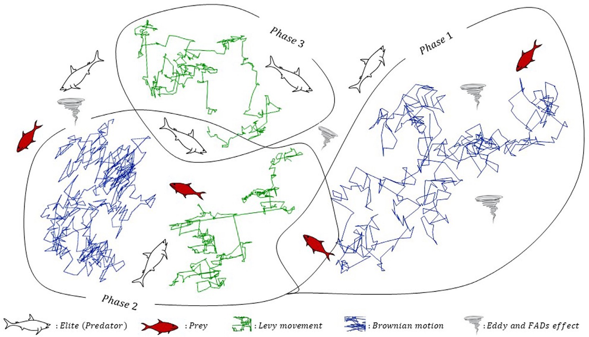
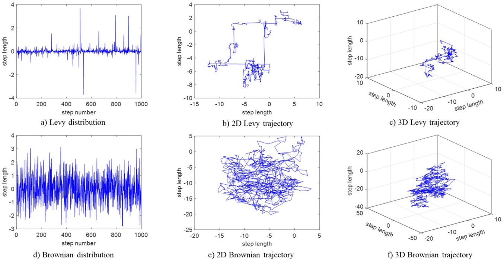

# Java implementation for Marine Predators Algorithm 

Unofficial implementation of Marine Predators Algorithm ([Main paper](https://www.sciencedirect.com/science/article/abs/pii/S0957417420302025) | [Official MATLAB source code](https://github.com/afshinfaramarzi/Marine-Predators-Algorithm)) in Java language.

This algorithm is based on natural behaviors of ocean predators in order to find prey. Main idea is to follow the foraging random strategies called Lévy (with short steps and occasion long jump, used to exploit the search environment) and Brownian (can trace and explore distant areas with steady steps, used to explore the search environment).

### How to customize your own solver: 
In order to solve your own optimization function, you need to change some details in the `mpa_java/Variable.java` file:
* The dimension of the variable: size
* Constraint 
* Fitness function